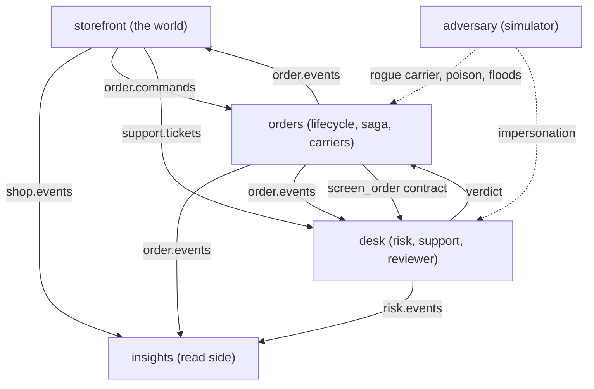

# Photon Market

Photon Market is a fictional online store built as a distributed system on the [Laser SDK](https://github.com/laserdata/laser-sdk) over [Apache Iggy](https://iggy.apache.org). The log is its messaging, replay, ordering, and audit spine. [Laser Stack](https://github.com/laserdata/laser-stack) provides the complete local data plane, including queryable projections, key value coordination, graphs, forks, and agent operations. The same binaries connect to LaserData Cloud for the full hosted experience without changing a service contract. An adversarial scenario shows how a multi agent system contains agents that lie, hallucinate, or impersonate.

## Run it in 60 seconds

```sh
just up      # pull and start Laser Stack, then wait for health
just demo    # run the market until Ctrl+C
just down    # stop Laser Stack and keep its data
```

The local stack pulls the current `laserdatainc/iggy-server` and `laserdatainc/laser-plane` images and exposes Iggy on `127.0.0.1`. Its default connection is `iggy:laser@127.0.0.1:8090`, and Laser SDK `0.0.1` uses VSR unconditionally. Run `just down-clean` when you also want to delete the Iggy and plane volumes.

The market keeps producing shopper sessions, orders, shipments, tickets, model replies, and random adversary acts. The local Laser Stack enables the same capability-gated projection, query, KV, graph, fork, watch, memory, and run paths as a supported managed deployment. Use `just demo-once` for the deterministic walkthrough that exits, or `just run-calm` for the long-running market without injected faults.

Point the same binaries at LaserData Cloud for the full hosted experience:

```sh
LASER_CONNECTION_STRING=user:pwd@your-host.laserdata.cloud just demo
```

Run against a real model instead of the deterministic mock:

```sh
LASER_LLM_PROVIDER=anthropic ANTHROPIC_API_KEY=... just demo llm-anthropic
```

## Read it like a book

| time | path | question answered |
| --- | --- | --- |
| 5 minutes | run `just demo-once`, then scan the [architecture](#architecture) | What is this system and what crosses each service boundary? |
| 20 minutes | follow [one order end to end](docs/walkthrough.md) | How do publish, consume, contracts, workflow, provenance, and replay compose? |
| 10 minutes | use the [Laser SDK map](docs/sdk-map.md) | Which primitive should I copy, where is its canonical use, and where does it run? |
| reference | open a [module README](#architecture) or run `cargo doc --workspace --no-deps --open` | What does one crate own, and which symbols should I read first? |

The [Laser SDK tutorial](https://github.com/laserdata/laser-sdk/blob/main/docs/tutorial.md) teaches each primitive in isolation. Photon Market starts one level later: it shows how those primitives compose across independently runnable Rust services. The [AGDX specification](https://github.com/laserdata/laser-sdk/blob/main/docs/agdx.md) defines the protocol underneath.

## Architecture

Services never call each other. Every edge below is a record on a topic, and the log is the only interface.



| module | role |
| --- | --- |
| [`shared`](crates/shared/README.md) | Owns contracts, names, connection setup, lifecycle plumbing, tracing, and shared test infrastructure. |
| [`storefront`](crates/storefront/README.md) | Generates the clickstream, places orders, and opens tickets. The only module that fabricates data. |
| [`orders`](crates/orders/README.md) | Owns the order lifecycle, inventory truth, the fulfillment saga, and the honest carriers it hires. |
| [`desk`](crates/desk/README.md) | Runs the risk and support agents plus a reviewer, all under an action governor. |
| [`insights`](crates/insights/README.md) | The read side. Projections, dashboards, forks, replay-safe audit, per-agent activity, and dead letters. |
| [`adversary`](crates/adversary/README.md) | Injects misbehavior from outside through the same public fabric. |
| [`demo`](crates/demo/README.md) | Composition root that starts the services for a long-running market or a finite walkthrough. |

## What each Laser SDK surface does here

This is the short inventory. The [Laser SDK map](docs/sdk-map.md) links every surface to the exact implementation and its executable proof.

| surface | where |
| --- | --- |
| publish, batch, partition keys | storefront |
| typed topics and schema registry | orders (`order.events`) |
| reliable consumer, commit-after-success, dedup, retry, dead letter | orders |
| typed replay and restart-safe state folds | orders, desk, insights |
| key value compare and swap, fenced leases | orders (inventory, charge) |
| contracts with deadlines, scatter and gather | orders (screening, carrier quotes) |
| workflow saga with journal resume and budgets | orders (fulfillment) |
| discovery, cards, presence, signed quarantine | orders (carriers), adversary |
| knowledge graph, memory, sessions, chunk streams | desk |
| approval gates, action governor | desk |
| projections, query DSL, watch, forks, run registry | insights |

## Agents and coordination

Coordination is the core of Photon Market, and all of it happens over the log. There is no orchestration server. Every agent is a reliable consumer whose logical `AgentId` is explicit and whose validated `ConsumerGroupName` controls replica load balancing. The group defaults from the agent id, but the types are not interchangeable. An agent that advertises a live inbox carries a capability card and owns a dedicated connection, because presence is connection scoped.

The order lifecycle shows the full fabric:

- **Contracts.** A high value order holds until the desk clears it. `orders` sends a `screen_order` contract routed by capability, with a deadline. A completed reply releases the order, a failure rejects it, a timeout parks it in manual review.
- **Workflow saga.** Each accepted order runs one journalled workflow: charge, quote, book, dispatch. Failure anywhere runs compensations in reverse. The run carries a budget and a stable run id, so a restart resumes from the journal instead of repeating a charge.
- **Scatter and gather.** The quote step fans out to every carrier advertising `quote_shipment` and takes a quorum, so one slow or lying carrier cannot starve the step. A verifier panel rejects an absurd quote before money moves.
- **Discovery and trust.** Carriers are discovered through cards, not hardcoded. Identity is a claim, effects need fences, and outputs need verification. Under the demo verifier every capability agent signs its contract replies, and the reviewer signs interrupt decisions, so a screening, saga-step, booking terminal, or approval is accepted only when its signature verifies and binds to the routed target. A rogue carrier is quarantined with a signed operator fact and later released with another. A forged unsigned quarantine and an impersonator's fabricated reply are both ignored.

The desk adds the agentic memory and safety story:

- **Memory and grounding.** Each customer maps to one stable session. Support combines recent ticket context, semantically recalled memory, and grounded order facts, and streams its replies as replayable AGDX `chat` chunks. On Laser Stack and LaserData Cloud that means log-backed durable memory with deterministic reranking, query-grounded order lookup, graph traversal, and a cross-process refund ledger.
- **Step-up approval.** A refund above `LASER_REFUND_CEILING` first returns `StepUpRequired`. The support agent then sends the reviewer a typed request carrying the grounded order value and the exact effect digest. The reviewer approves only a matching grounded refund, the handler records a one-use grant for that digest, and the governed publish is retried.
- **Fail closed.** Fabricated memory, inflated refunds, and digest-mismatched approval decisions are all rejected.

## The adversary

`LASER_ADVERSARY=random` selects seeded faults at a configured rate and is the default for `just demo`. `scripted` runs the fixed sequence used by `just demo-once`. `off` disables fault injection.

| threat | defense |
| --- | --- |
| hallucinated output | deterministic verification plus the action governor |
| over privileged effect | approval gate plus key value fence |
| impersonation | broker ACLs, signatures, explicit principal mapping |
| runaway | budgets and deadlines |
| poison and duplicates | dead letter, dedup, and selective redrive |

## Run modes and configuration

- `just demo` runs a paced market until Ctrl+C with seeded shopper behavior, random adversary acts, occasional deterministic model skew, the governor in enforce mode, and continuous dead-letter repair. This is also the default no-argument `photon-demo` behavior.
- `just demo-once` runs the deterministic scripted scenario and exits. Use this for a bounded walkthrough or automation.
- `just run-calm` keeps the same long-running traffic with fault injection and model skew disabled.
- `cargo run -p photon-demo -- --help` prints the two binary modes without connecting. `cargo run -p photon-demo` runs forever using the supplied `LASER_*` values. Add `-- finite` for one bounded run.

The terminal separates trusted narration from application telemetry: phase headings and the run profile stay visually clean, while business events retain timestamps and structured fields. Insights prints one compact operating line every four seconds:

```text
◆ LIVE 00:01:24 | shop 184 browse / 31 checkout | orders 26 accepted / 22 shipped / 20 delivered / 3 rejected / 1 refunded | safety 2 dlq / 4 decisions / 0 violations
```
- `cargo run -p photon-orders` runs a single service, the microservice experience.

Connection variables mirror the Laser SDK examples: `LASER_CONNECTION_STRING`, or `LASER_SERVER` with `LASER_TOKEN` / `LASER_USERNAME` + `LASER_PASSWORD`, plus `LASER_TLS_CERT` and `LASER_NO_TLS`. The local default is `iggy:laser@127.0.0.1:8090`. If you override `LASER_IGGY_USERNAME`, `LASER_IGGY_PASSWORD`, or `LASER_IGGY_PORT` for Compose, set `LASER_CONNECTION_STRING` to the same values before running a service.

| variable | default | effect |
| --- | --- | --- |
| `LASER_ADVERSARY` | `off` | `scripted` or `random` |
| `LASER_ADVERSARY_SEED` | `1312` | seed for the `random` adversary |
| `LASER_ADVERSARY_RATE` | `6` | acts per minute for the `random` adversary |
| `LASER_CONCURRENCY` | `3` | independent seeded shopper streams |
| `LASER_SESSION_INTERVAL_MS` | `250` | approximate interval between sessions per shopper stream |
| `LASER_LLM_PROVIDER` | `mock` | `mock`, `anthropic`, or `openai` (must be compiled and keyed) |
| `LASER_LLM_SKEW` | `0` | per mille chance the model decorator corrupts a completion |
| `LASER_GOVERNOR` | `observe` | `enforce` blocks over policy effects |
| `LASER_REFUND_CEILING` | `30000` | refund amount in cents that requires reviewer approval |
| `LASER_SCENARIO_SEED` | fixed | shopper data and scripted inputs |
| `LASER_RISK_THRESHOLD` | sensible | order value in cents that triggers screening |
| `LASER_CRASH_AFTER` | unset | stop the orders coordinator after a named workflow step |
| `LASER_ZOMBIE_CHARGE` | unset | managed only stale charge worker scenario |
| `LASER_APPLY_PLAN` | unset | promote or squash the flash sale fork |

`just demo` intentionally overrides several defaults for terminal readability: one shopper, roughly 900 ms per session, four adversary acts per minute, 100 permille model skew, and enforced governance. Explicit environment values always win.

Ctrl+C and SIGTERM stop ingress and drain in-flight work within fixed deadlines. A forced kill relies on replay and idempotency instead. [Architecture](docs/architecture.md#shutdown-and-process-death) states the exact contract.

## Testing

```sh
cargo test --workspace   # unit, Docker free
just test-it             # focused LaserData Iggy fork integration
just e2e                 # full Docker scenario
just ci                  # the whole gate
```

The strongest proof in the suite is the crash-resume e2e,
`given_the_coordinator_crashed_after_charge_when_restarted_then_should_resume_without_a_second_charge`:
it kills the orders coordinator right after the charge step commits, restarts it, and asserts the
order ships with exactly one `Charged` event on the log.

## Layout

New to the codebase? Follow one order end to end in [docs/walkthrough.md](docs/walkthrough.md): `PlaceOrder` through dedup, risk screening, the fulfillment saga, and the insights fold, with the provenance chain and the crash-resume contract along the way.

See [AGENTS.md](AGENTS.md) for the crate tree and conventions, and [docs/architecture.md](docs/architecture.md) for boundaries, delivery semantics, and the local versus managed matrix.

## License and status

Apache-2.0.
