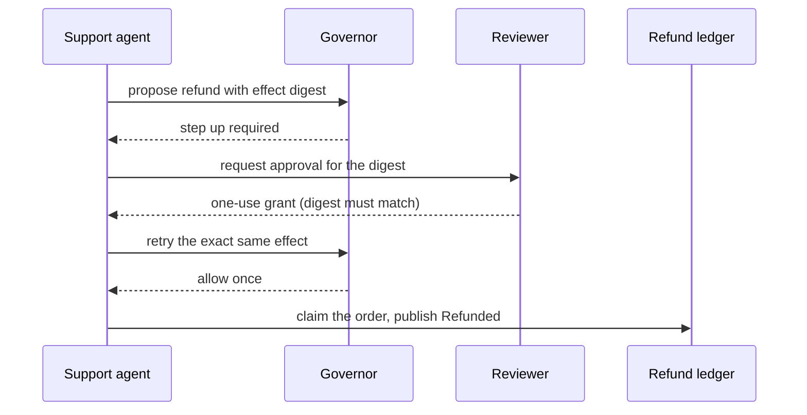

# Photon desk

The desk is Photon Market's agentic safety boundary. It screens risky orders, answers grounded support tickets, and places refund effects behind an action governor and a visible reviewer.

## What it does

1. The risk agent advertises `screen_order`, recalls customer precedent, records customer-device-card links, and applies a deterministic policy: an outsized amount rejects, a ring link or repeat-rejection precedent parks the order in review for the human gate (digest-bound, fails closed on timeout), and everything else clears. Laser Stack and LaserData Cloud use durable memory and graph traversal. Every terminal verdict lands on `risk.events` and answers the screening contract.
2. The support agent consumes `support.tickets`, enforces a stable `SessionPolicy::PerUser` conversation, combines bounded ticket context with semantically recalled support memory and grounded order facts, and uses the configured `LlmClient` only to phrase status answers. Laser Stack and LaserData Cloud query the orders projection.
3. Damaged-order refunds use the charged amount from the log. Laser Stack and LaserData Cloud claim the order through KV CAS for cross-process idempotency. In enforce mode, an over-ceiling publish steps up before the effect occurs.
4. The reviewer receives a typed request addressed to it on `agent.sessions`. It approves only when the proposed refund matches the grounded order value and returns the exact proposed-effect digest in a signed interrupt response when verification is enabled.
5. An approval becomes a one-use grant keyed by conversation, scope, and digest. The same governed publish is retried, while altered payloads and repeated tickets cannot reuse the grant.
6. Every status answer is emitted as a buffered AGDX `chat` stream on `agent.sessions`, with model token usage on the terminal chunk. Model failures produce a bounded grounded fallback.

The over-ceiling refund handshake, end to end:



## Run it

```sh
just up
LASER_GOVERNOR=enforce LASER_REFUND_CEILING=30000 cargo run -p photon-desk
```

The default `mock` model needs no API key. Use `LASER_LLM_PROVIDER=anthropic` or `openai` only with the matching compiled feature and key.

## Where to look

On Laser Stack and LaserData Cloud, inspect `support.tickets`, `order.events`, `risk.events`, `agent.sessions`, and `agent.audit` in the `photon` stream. The `support`, `risk`, and `reviewer` consumer groups show the three independent agents. The managed surfaces add the `orders` projection, the `fraud` graph, the `risk` and `support` memory views, and the refund KV namespace.

## Highlights

- `runtime` selects local folds or managed memory, query, graph, and KV at startup. Handlers receive narrow traits and remain deployment-independent.
- `Agent::builder` runs the ticket and human-input handlers through reliable consumer groups.
- Managed query and KV select log-backed memory wrapped by `DeterministicReranker`. `MemoryBackend::Vector` remains the explicit open-server fallback used by baseline tests.
- `Laser::with_governor` covers both agent effects and typed topic publishes (`risk.events`, `order.events`).
- `AgentCtx::approval_gate` and `respond_input` park and resume the refund handler through the log.
- `ApprovalGrants` binds a decision to one conversation, scope, and SHA-256 payload digest.

Focused e2e tests prove per-user recall across tickets, deterministic chunk reassembly, fabricated-memory containment, and exactly one `Refunded` event after six damaged-ticket deliveries.
