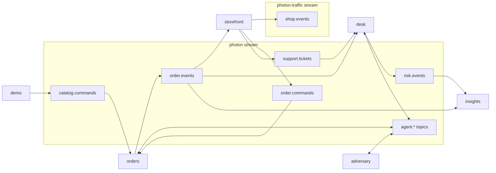

# Laser SDK map

Use this page as an index, not as a tutorial. Start with the row matching the problem you need to solve, open the named symbol, and copy the smallest complete pattern around it. The [SDK tutorial](https://github.com/laserdata/laser-sdk/blob/main/docs/tutorial.md) explains each primitive in isolation. The [Photon walkthrough](walkthrough.md) explains how the patterns compose into one order journey.

## The mental model

Photon Market follows the five-layer vocabulary from the [AGDX specification](https://github.com/laserdata/laser-sdk/blob/main/docs/agdx.md). A layer only depends on the layers below it.

```text
edges       external A2A, MCP, AG-UI clients             not used here
fabric      agents, contracts, workflows, memory         orders, desk, adversary
platform    streaming, projections, query, KV, forks     every service, insights
wire        typed contracts, provenance, schemas         shared
substrate   durable partitioned log                      Apache Iggy
```

The substrate, wire, and open fabric run on Apache Iggy. Laser Stack adds the complete managed plane locally, and LaserData Cloud serves the same managed read models and coordination primitives as a hosted deployment. Capability negotiation chooses an implementation at startup. Business contracts do not change.

## Find a pattern

| problem | Laser primitive | canonical Photon symbol | local Laser Stack | LaserData Cloud |
| --- | --- | --- | --- | --- |
| Name streams, topics, agents, and capabilities once | typed application enums | [`BusinessTopic`, `AppAgent`, `Skill`](../crates/shared/src/names.rs) | yes | yes |
| Publish typed JSON with lineage and a partition key | `topic.publish().json().provenance().send()` | [`publish_business`](../crates/shared/src/publish.rs) | yes | yes |
| Publish a high-volume keyed batch | `publish_batch()` | [`publish_session`](../crates/storefront/src/publisher.rs) | yes | yes |
| Consume with groups, dedup, retry, and dead-lettering | `ReliableConsumer` | [`spawn_consumer`](../crates/orders/src/lib.rs) | yes | yes |
| Pin a topic's writer contract | typed topic plus schema id | [`events::Publisher`](../crates/orders/src/events.rs) | JSON Schema guard | JSON Schema guard |
| Route work by advertised capability and deadline | `contract` plus `Router::to_capable` | [`OrdersHandler::screen`](../crates/orders/src/handler.rs) | yes | yes |
| Ask every capable agent and accept a quorum | `AgentCtx::fan_out` | [`Fulfillment::handle`](../crates/orders/src/fulfillment.rs) | yes | yes |
| Run steps with a journal, budget, verifier, and compensation | `workflow` | [`run_saga`](../crates/orders/src/saga.rs) | registered run | registered run |
| Rebuild state after a process dies | typed replay and fold | [`recovery::rebuild`](../crates/orders/src/recovery.rs) | yes | yes |
| Make inventory reservation idempotent | local fold or `kv` CAS | [`Inventory`](../crates/orders/src/inventory.rs) | cross-process CAS | cross-process CAS |
| Reject a stale workflow holder at an effect boundary | fenced `kv` CAS | [`ManagedChargeLedger`](../crates/orders/src/charge.rs) | fenced CAS | fenced CAS |
| Remember and semantically recall facts | `memory` | [`RiskAgent`](../crates/desk/src/risk.rs) | durable memory | durable memory |
| Traverse fraud relationships | `graph` | [`RiskLinks`](../crates/desk/src/links.rs) | knowledge graph | knowledge graph |
| Ground support answers in order truth | replay or `query` | [`OrderReader`](../crates/desk/src/order_lookup.rs) | orders projection | orders projection |
| Pause an effect for a bound approval | action governor plus `approval_gate` | [`DeskGovernor`](../crates/desk/src/governor.rs) | yes | yes |
| Stream replayable model output | AGDX chunk stream | [`SupportAgent`](../crates/desk/src/support.rs) | yes | yes |
| Declare queryable read models | `Projection` and `ProjectionBinding` | [`projections::register`](../crates/insights/src/projections.rs) | projections and query | projections and query |
| Await a materialized view advance | `watch` | [`watch_loop`](../crates/insights/src/managed.rs) | change feed | change feed |
| Test a speculative change without touching the trunk | `fork` | [`flash_sale`](../crates/insights/src/managed.rs) | copy-on-write fork | copy-on-write fork |
| Audit policy decisions without double counting replay | `PolicyEvidence` and `SwarmActivity` | [`EvidenceChains::fold`](../crates/insights/src/dashboards.rs) | yes | yes |
| Quarantine a discovered agent with authenticated evidence | signed registry fact | [`scenario::run`](../crates/demo/src/scenario.rs) | yes | yes |
| Repair and redrive selected dead letters | dead-letter capsule plus republish | [`repair_and_redrive`](../crates/demo/src/operator.rs) | yes | yes |

Both columns run the same application path. Each managed cell names the implementation selected when the connected Laser Stack or LaserData Cloud deployment advertises the required capability.

## How capability branching reads

Branch once, at composition time, behind an application trait. Keep domain handlers unaware of the deployment.

```rust,ignore
let inventory: Arc<dyn Inventory> = if capabilities.kv.cas {
    Arc::new(ManagedInventory::new(laser.clone()))
} else {
    Arc::new(LocalInventory::new())
};
```

The complete pattern is in [`Runtime::prepare`](../crates/orders/src/runtime.rs). The desk applies the same shape to memory, fraud links, order lookup, and refunds in its [`runtime` module](../crates/desk/src/runtime.rs). A managed operation that fails after startup returns an error. It never falls back silently.

## Topic topology

Business topics use application JSON contracts. Agent topics use the typed AGDX envelope. Both are ordinary Apache Iggy topics on the same authenticated connection.



`shop.events` is isolated because clickstream volume and retention differ from the business fabric. All order-related records use the order's `ConversationId` as their partition key, preserving per-order order without claiming global order.

## Read the guarantees, then the implementation

| guarantee | focused proof |
| --- | --- |
| wire spelling and provenance stay stable | `cargo test -p photon-shared` |
| inventory and charge effects are idempotent | `cargo test -p photon-orders` |
| risk, refund, and approval policy fail closed | `cargo test -p photon-desk` |
| evidence folds tolerate replay and restart boundaries | `cargo test -p photon-insights` |
| open streaming topology works against real Apache Iggy | `just test-it` |
| crash-resume, reservation cleanup, adversarial containment, recall, and redrive compose | `just e2e` |

The strongest proof is `given_the_coordinator_crashed_after_charge_when_restarted_then_should_resume_without_a_second_charge` in [`crates/demo/tests/e2e.rs`](../crates/demo/tests/e2e.rs). It kills the coordinator after the durable charge, restarts it, and proves the order ships with one charge.

## Rules worth copying

- Put all inter-service contracts in one small shared crate. Do not put business logic there.
- Make names, ids, money, timestamps, and contract versions domain types, not strings and primitives scattered through handlers.
- State delivery honestly: at least once, ordered per partition, replayable by offset.
- Give every effect a stable business key. Use dedup for traffic and idempotent state transitions for correctness.
- Treat every agent-authored identity as a claim until broker credentials or a verified signature bind it.
- Verify model and agent output before an effect. Put approval and governance at the effect boundary, not in prompt prose.
- Keep open-server fallbacks explicit about their scope. Capability-gate managed semantics and never silently downgrade after startup.
- Test folds and policy as pure logic, then prove the important composition boundaries against a real log.
