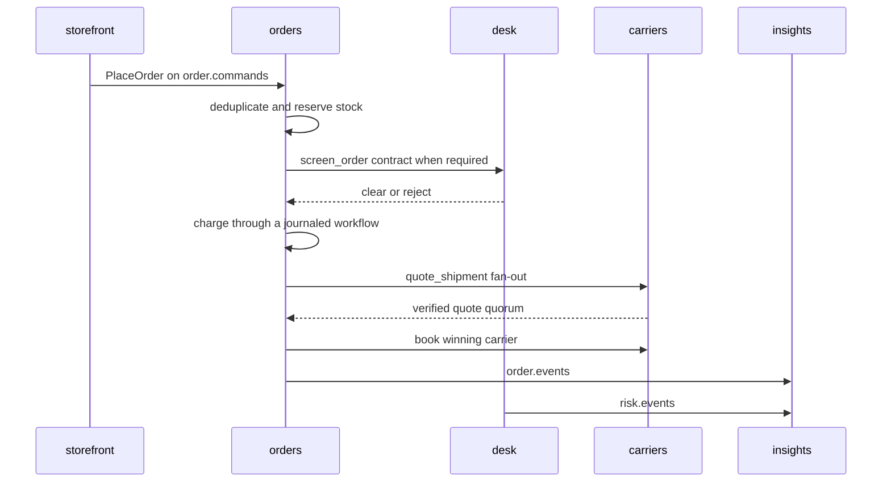

# Walkthrough: one order

Run `just up`, then `just demo-once` in another terminal. This page maps the visible order flow to the code that implements it.

Services do not call each other. Commands, events, contracts, replies, and workflow records all use the same log.

## 1. Checkout

`ShopperWalk::next_session` in `crates/storefront/src/shoppers.rs` generates seeded sessions. It varies the customer, browsing path, product, cart outcome, quantity, device, address, and card. A process epoch keeps new session and order IDs unique after restart.

`publish_session` in `crates/storefront/src/publisher.rs` sends clickstream events as one partitioned batch. A checkout calls `publish_order`, which publishes `PlaceOrder` with:

- the order ID as `ConversationId` and partition key
- `AppAgent::Storefront` as the source
- `place-order/{order}` as the idempotency key

`publish_business` in `crates/shared/src/publish.rs` writes that provenance into AGDX headers.

## 2. Intake

`Runtime::prepare` in `crates/orders/src/runtime.rs` selects local or managed state backends once at startup. `spawn_consumer` in `crates/orders/src/lib.rs` runs `OrdersHandler` behind a `ReliableConsumer` with a `SlidingWindow` deduplicator.

`OrdersHandler::handle` in `crates/orders/src/handler.rs`:

1. Decodes and validates `PlaceOrder`.
2. Reads `OrderStates`, rebuilt from `order.events` at startup.
3. Emits `Received` when the order is new.
4. Reserves inventory.
5. Screens orders at or above the risk threshold.
6. Emits `Accepted` or releases inventory and emits `Rejected`.

A durable decision makes redelivery a no-op. A `Reserved` order resumes screening without reserving stock twice. An unknown SKU goes to the dead-letter topic. `repair_and_redrive` in `crates/demo/src/operator.rs` restocks that SKU and redrives the original command.

`Inventory` in `crates/orders/src/inventory.rs` selects its implementation from the capabilities advertised at connection time. Both supported runtime targets advertise managed KV:

| local Laser Stack | LaserData Cloud |
| --- | --- |
| key value compare-and-swap through the local plane | key value compare-and-swap through the hosted plane |

## 3. Risk contract

`OrdersHandler::screen` sends `ScreenRequest` to an agent advertising `screen_order`. The request has a five-second deadline. No completed clear verdict means rejection.

`RiskAgent` in `crates/desk/src/risk.rs` combines:

- deterministic amount rules
- device and card rings from `RiskLinks`
- prior customer verdicts from memory

A review case carries a SHA-256 digest of the exact request. `AgentCtx::approval_gate` waits for `ReviewerAgent`. The reply must echo the digest. A mismatch, rejection, or timeout fails closed.

The desk publishes `RiskCaseEvent` to `risk.events` and returns the same typed event as the contract reply.

## 4. Fulfillment workflow

`run_saga` in `crates/orders/src/saga.rs` uses the order conversation as its stable run ID. It defines four journaled steps under an invocation and time budget:

| step | action | compensation |
| --- | --- | --- |
| charge | idempotent charge | refund |
| quote | verified carrier quorum | none |
| book | directed carrier booking | release booking |
| dispatch | emit `Shipped` | none |

`Fulfillment::handle` in `crates/orders/src/fulfillment.rs` executes each task.

The quote step calls `AgentCtx::fan_out` for every agent advertising `quote_shipment`. Replies count only when the contract version, order ID, and sender identity match. `QuotePanel::ranked` in `crates/orders/src/quotes.rs` rejects non-positive or implausible quotes. Borealis therefore cannot win with its negative quote.

Booking first tries the best verified quote, then the runner-up. Honest carriers return the same booking for a redelivered request.

`delivery::run` in `crates/orders/src/delivery.rs` tails `Shipped` events and publishes `Delivered` after a short seeded delay. It commits the shipment offset only after `Delivered` is durable.

On failure, the workflow compensates in reverse. `supervise` then releases the inventory reservation. Every state change is an `OrderEvent`.

## 5. Read side

`Dashboards` in `crates/insights/src/dashboards.rs` folds shop events, order events, dead letters, and policy evidence. Replay cannot inflate policy activity because evidence is deduplicated by decision ID.

On Laser Stack and LaserData Cloud, `projections::register` declares the `orders`, `shop_events`, `tickets`, and `risk_cases` indexes. `managed.rs` demonstrates grouped queries, watch feeds, workflow runs, and a forked flash-sale change. Producers are unchanged.

## 6. Provenance

The order ID remains the conversation ID for the entire flow. It provides:

- per-order partition ordering
- the `gen_ai.conversation.id` header
- the fulfillment run ID
- one key for replaying the order journey

Agent replies and workflow records retain the conversation and add `agdx.cause` for their parent message. Stable `agdx.idem` values name each business effect.

## 7. Crash recovery

Set `LASER_CRASH_AFTER=charge` to stop the coordinator after the charge is durable but before shipment.

On restart, `resume_incomplete_sagas` in `crates/orders/src/recovery.rs`:

1. Rebuilds `ConversationState` from `order.events`.
2. Selects orders in `Accepted` or `Charged` state.
3. Loads their original `PlaceOrder` commands.
4. Restarts each workflow with the same run ID.

The journal reuses the completed charge. The end-to-end test `given_the_coordinator_crashed_after_charge_when_restarted_then_should_resume_without_a_second_charge` proves one charge and a successful shipment.

## Next

- [architecture.md](architecture.md) defines boundaries and delivery guarantees.
- [sdk-map.md](sdk-map.md) maps each Laser SDK primitive to its canonical symbol.
- Per-crate READMEs list ownership and the best entry points.
